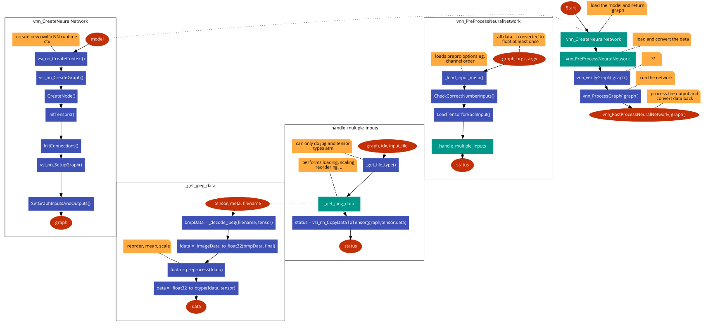

## About
In this step the onnx file is converted to an nb file.

## Howto
1. Place nopnet.onnx file into network folder
2. Run convert.bat
3. Copy file from nb folder to step 3

## Note
The file nopnet-markus-mod.quantize was used to change the quantization conducted in script 2_export_case_code.sh.
The file was adapted based on the output of script 1_quantize_model.sh.
Also the code in the next step (3_compile_and_run...) was adapted to not convert the input format in any way.
We are reading uint8 and we are processing uint8 in the network and we are outputting uint8.

## Code flow
